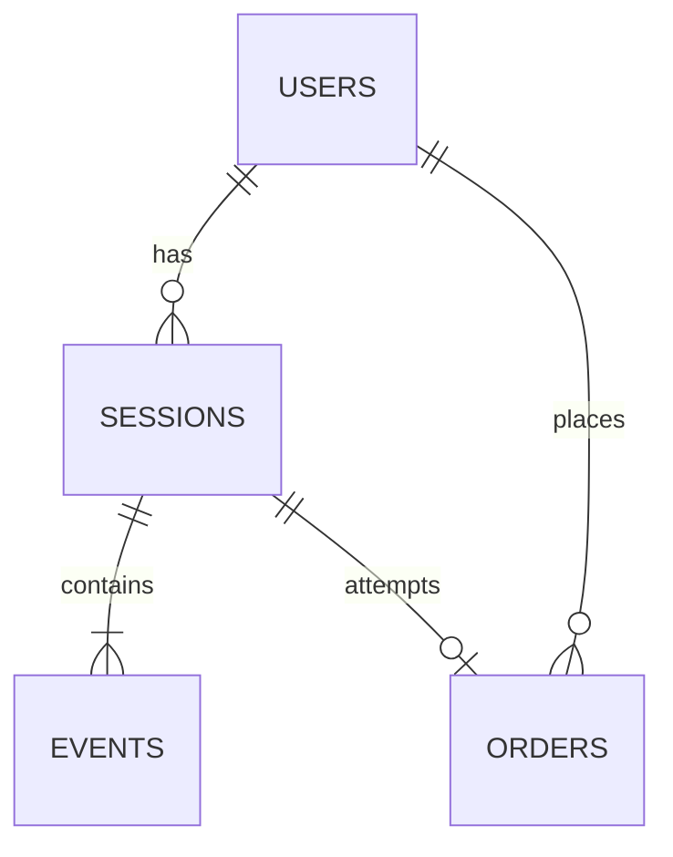
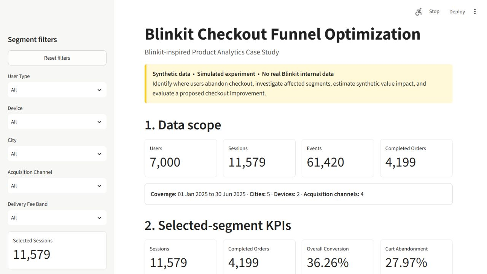
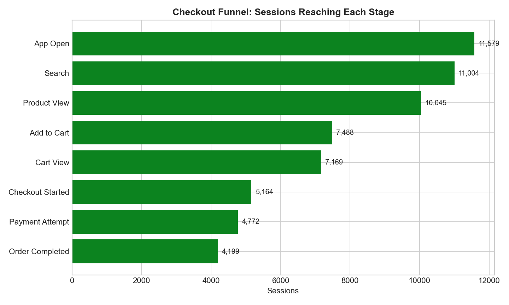
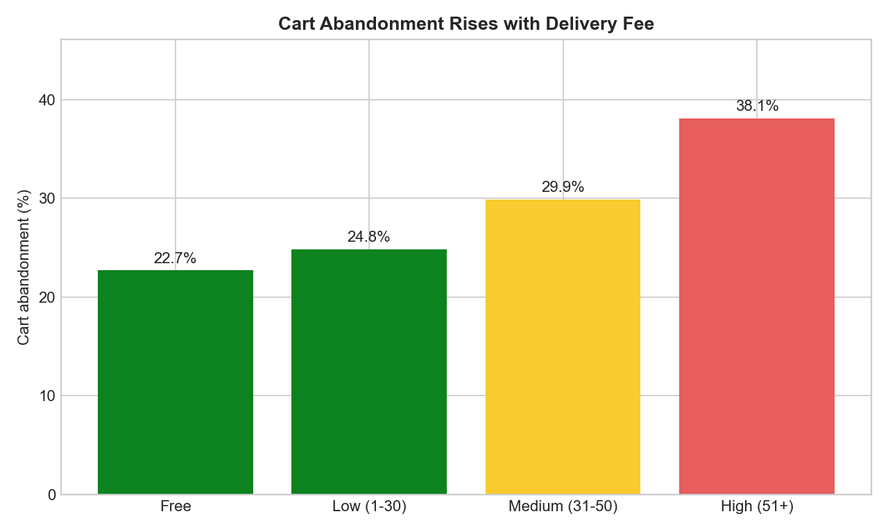
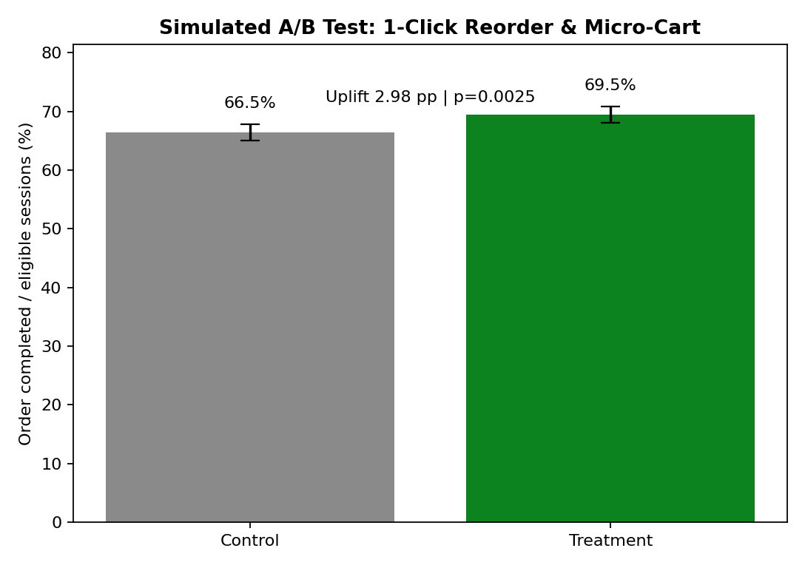

# Blinkit Checkout Funnel Optimization

> This is a Blinkit-inspired product analytics case study using synthetic data. It does not use or represent Blinkit internal data. The A/B test is simulated.

## Project overview

This project follows 11,579 synthetic shopping sessions through an event-level funnel to answer one product question: **where does checkout lose the most value, who is affected, what appears related to the loss, and what should be tested?**

The repository is designed as a placement-ready case study for Product Analyst, Data Analyst, and Business Analyst roles. One command regenerates the data, validates it, rebuilds SQLite, runs the SQL, checks the metrics in Python, simulates the experiment, and recreates the exports and charts.

## Business problem and objective

The funnel is:

`App Open → Search → Product View → Add to Cart → Cart View → Checkout Started → Payment Attempt → Order Completed`

The objective is to identify the largest checkout loss, diagnose associated factors without claiming causation, estimate the synthetic revenue opportunity, and evaluate a **1-Click Reorder & Micro-Cart** concept for eligible repeat customers.

## Dataset and data model

The fixed seeds (`42` for behavior and `2025` for the experiment) generate:

- 7,000 users, 11,579 sessions, and 61,420 events across January–June 2025
- 4,772 payment attempts and 4,199 completed orders
- Moderate behavioral relationships: returning users convert and spend more, fees reduce checkout starts, and Android/payment-method reliability varies

SQLite contains four understandable tables:



`orders` holds one record per payment-attempt session; `payment_status = 'Success'` identifies completed orders. Session-level `cart_value` and `delivery_fee` allow transparent abandonment estimates.

## Tools used

- Python, pandas, NumPy: generation, validation, metrics, and exports
- SQLite and SQL: funnel, segment, payment, time, and repeat-order analysis
- SciPy: normal distribution used in the two-proportion z-test
- Matplotlib: selected decision-focused charts
- Streamlit: lightweight interactive presentation layer over validated outputs

## Live demo

The Streamlit dashboard turns the analysis into a short interview walkthrough without moving business logic into a frontend. It reads the generated session funnel, order, and experiment outputs; filters are applied in memory and never regenerate synthetic data.



After building the pipeline, launch the demo from the repository root:

```bash
python -m streamlit run demo/app.py
```

Use the sidebar to select user type, device, city, acquisition channel, or delivery-fee band. The page then follows the presentation flow: business context → filtered KPIs and funnel → biggest drop-off → segment/root-cause investigation → delivery-fee impact → adjustable synthetic revenue scenario → fixed simulated A/B test → recommendation. The data banner and caveats remain visible so the demo cannot be mistaken for real Blinkit results.

## Key metrics

| Metric | Result | Definition |
|---|---:|---|
| Overall conversion | 36.26% | Order Completed / all sessions |
| Checkout completion | 81.31% | Order Completed / Checkout Started |
| Cart abandonment | 27.97% | 1 − Checkout Started / Cart View |
| Payment failure | 12.01% | Failed payment attempts / all payment attempts |
| Completed orders | 4,199 | Successful payment sessions |
| Average order value | ₹775.33 | Successful order value / completed orders |
| Synthetic revenue | ₹3,255,615.83 | Sum of successful order value |
| Repeat-purchaser rate | 19.89% | Purchasing users with 2+ completed orders / purchasing users |

## Analysis approach

1. Generate sequential events so no session can skip a required funnel stage.
2. Validate IDs, keys, timestamps, allowed values, amounts, chronology, and event order.
3. Load the four CSVs into SQLite and execute 11 named SQL analyses.
4. Recalculate the funnel and KPIs in pandas and assert equality with SQL.
5. Drill from user type to device, city, payment method, acquisition channel, and delivery-fee band.
6. Estimate value associated with abandonment and run a simulated randomized experiment.



## Key findings and root-cause drill-down

- The biggest full-funnel percentage loss is **Cart View → Checkout Started**: 2,005 sessions drop, a 27.97% abandonment rate. Product View → Add to Cart loses more sessions (2,557), but the cart transition is the largest checkout loss and is closer to purchase intent.
- Returning users convert at 40.25% versus 31.69% for new users. Their cart-to-checkout rate is 7.05 percentage points higher and AOV is ₹820.16 versus ₹709.95.
- Free-delivery carts start checkout at 77.31%; high-fee carts (₹51+) do so at 61.90%, a 15.41-point gap.
- Kolkata's cart-to-checkout rate is 68.12% versus 74.66% in Hyderabad, a 6.54-point gap.
- Android payment failure is 13.61% versus 8.26% on iOS. Cash on Delivery has the highest method-level failure rate (16.88%), while Wallet has the lowest (9.42%).
- Paid Social converts at 31.77%, below Organic at 39.37%, suggesting a lower-intent traffic mix.

These are observational associations built into synthetic data. They suggest potential contributors; they do not establish causality.



## Synthetic revenue impact

- Cart value associated with all Cart View sessions that did not complete: **₹2,244,036.76**.
- Cart value associated specifically with Cart View → Checkout Started drop-off: **₹1,495,821.86**.
- Illustrative opportunity: **₹121,629.67**, calculated as `₹1,495,821.86 × 10% recovered × 81.31% observed post-checkout completion`.

This is a case-study estimate of cart value associated with loss—not booked revenue, forecast revenue, or real Blinkit impact. The 10% recovery assumption is deliberately explicit and should be replaced by experiment evidence in a real setting.

## Simulated A/B test

The simulated experiment randomizes 9,000 eligible repeat-customer sessions equally:

| Result | Control | Treatment |
|---|---:|---:|
| Eligible sessions | 4,500 | 4,500 |
| Conversion | 66.49% | 69.47% |
| Checkout completion | 84.38% | 85.39% |
| Average order value | ₹804.91 | ₹801.62 |
| Payment failure guardrail | 11.19% | 10.04% |

Treatment uplift is **+2.98 percentage points** or **+4.48% relative**. The 95% confidence interval for the absolute difference is **+1.05 to +4.90 points**; the two-sided two-proportion z-test gives **p = 0.0025**. At α = 0.05, the simulated result is statistically significant, while AOV is broadly stable and the payment-failure guardrail does not worsen.



## Recommendations

| Observation | Business impact | Recommended action | Metric to monitor |
|---|---|---|---|
| Returning users have stronger checkout intent and the simulated test lifts conversion | A trusted flow can remove repeated effort near purchase | A/B test 1-Click Reorder & Micro-Cart for repeat customers with saved address and preferred payment; retain normal checkout as fallback | Eligible-session conversion, checkout completion, payment failure, AOV |
| High-fee carts trail free delivery by 15.41 points | Late fee surprise is associated with high-intent abandonment | Show the delivery fee and free-delivery threshold before Cart View; test a clear threshold progress message | Cart-to-checkout conversion by fee band, margin/order |
| Android payment failure exceeds iOS by 5.35 points | Payment friction loses users after they have started checkout | Instrument error codes and prioritize fixes for the largest Android failure categories | Payment failure by OS/app version/method |
| New users trail returning users by 7.05 points at cart-to-checkout | Address/payment setup may create first-order friction | Test a shorter guest-style first checkout with progressive profile capture | New-user checkout completion and support/error rate |

## Dashboard and outputs

The Streamlit demo is the primary live presentation layer. Dashboard-ready CSVs in `outputs/tables/` also support an optional three-page Power BI build: Funnel Overview, Segment Analysis, and Experiment. See [`dashboard/dashboard_guide.md`](dashboard/dashboard_guide.md) for measures, sources, and layout. The small product-flow specification is in [`design/checkout_redesign.md`](design/checkout_redesign.md).

## Project structure

```text
├── data/raw/                  # Deterministic users, sessions, events, orders CSVs
├── data/processed/            # SQLite database and simulated experiment data
├── sql/                       # Schema and executable funnel/segment SQL
├── src/                       # Generation, validation, database, metrics, A/B test, runner
├── outputs/charts/            # Four generated PNG charts
├── outputs/tables/            # SQL results and dashboard-ready exports
├── demo/                      # Streamlit app, calculation helpers, validation, screenshot
├── dashboard/dashboard_guide.md
├── design/checkout_redesign.md
├── INTERVIEW_NOTES.md
└── requirements.txt
```

## How to run

From the repository root with Python 3.11+:

```bash
python -m pip install -r requirements.txt
python src/run_project.py
python -m streamlit run demo/app.py
```

The runner executes generation → validation → SQLite build → SQL/Python analysis → simulated A/B test → Streamlit calculation/UI validation → final output validation. It does not start a web server. The last command launches the read-only demo after the outputs exist. Individual scripts can also be run in pipeline order for explanation or debugging.

## Limitations

- All behavior and currency values are synthetic; there is no Blinkit internal data.
- The experiment is simulated, not a real production test or deployment.
- User behavior, retry logic, inventory, promotions, and delivery operations are simplified.
- One payment record per session omits multi-retry payment journeys.
- Observational segment differences do not establish causality and may be confounded.
- Revenue estimates use intended cart value and an illustrative recovery assumption, not realized incremental revenue.
