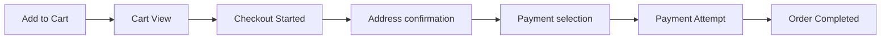
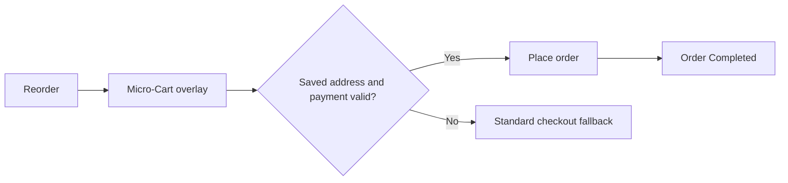

# Checkout Redesign: 1-Click Reorder & Micro-Cart

## Current flow



The main measured friction point is **Cart View → Checkout Started**, where 27.97% of cart-view sessions drop. High delivery fees, new-user status, and Kolkata are associated with a lower transition rate. Android and some payment methods add a separate reliability issue later.

## Proposed repeat-customer flow



```text
┌─────────────────────────────┐
│ Reorder your usual basket   │
│ 6 items              ₹782   │
│ Delivery fee          ₹29   │
│ Deliver to: Home · 18 min   │
│ Pay with: UPI •••• 2142     │
│                             │
│ [ Change ]  [ Place order ] │
│ Secure payment · Edit later │
└─────────────────────────────┘
```

## Eligibility and safeguards

- Show only to repeat customers with a prior successful order, serviceable saved address, available items, and valid preferred payment.
- Display item total, delivery fee, ETA, address, and payment before the final action; this is simplified checkout, not hidden consent.
- Route substitutions, price changes above a defined tolerance, missing items, or invalid payment details to standard checkout.
- Preserve accessible focus order, a clear back/change action, and an order-review confirmation where regulation or payment method requires it.

## Test hypothesis and measures

**Hypothesis:** reducing repeated address/payment decisions for eligible repeat users will increase eligible-session conversion without worsening payment failure or average order value.

Primary metric: Order Completed / eligible sessions. Secondary metric: Order Completed / Checkout Started. Guardrails: payment failure, AOV, cancellations, refunds, support contacts, and accidental-order rate. The current repository evaluates the first four with a simulated experiment; production guardrails would require real operational data.
